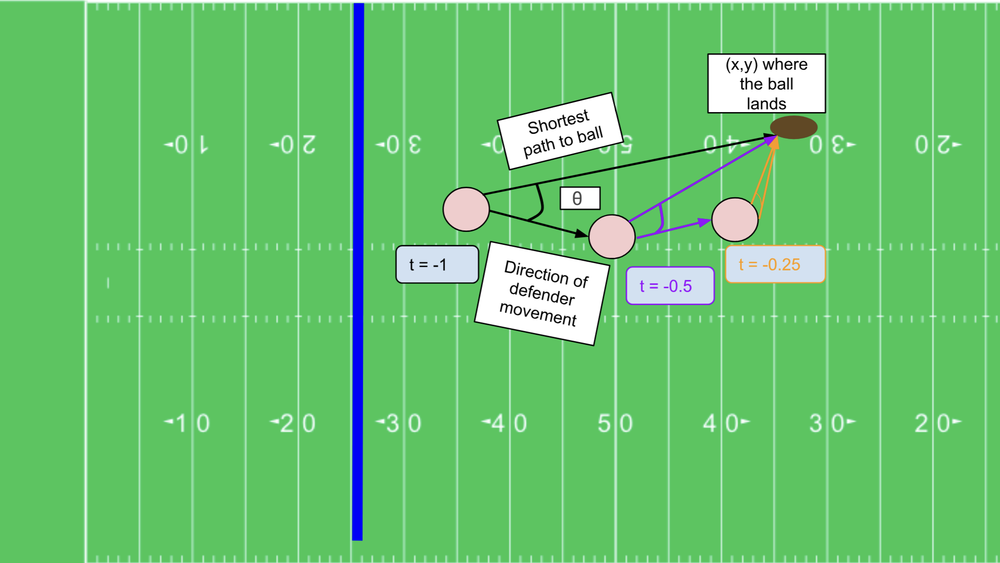

2026 Big Data Bowl submission focused on measuring a defenders "commitment" to the ball. I worked with Archith Sharma to apply basic geometry to create a novel metric that communicates defender movement when the ball is in the air. We used XGBoost for predictive modeling and outcome correlation.