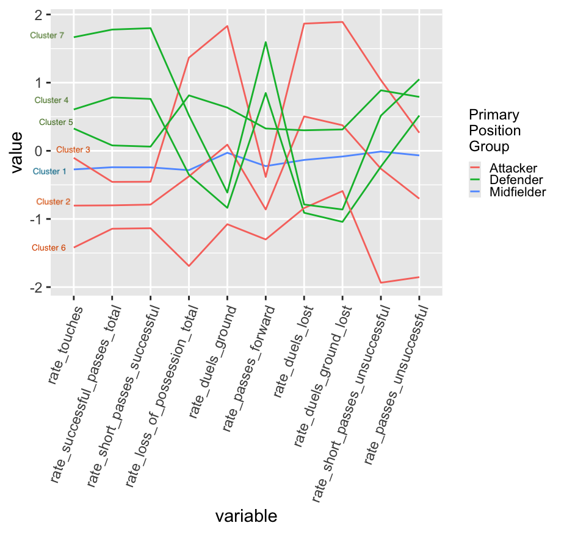

What makes a midfielder different from a defender? And are all attackers the same? Using clustering analysis on NWSL player statistics from 2023–2024, I identified multiple subgroups within each traditional position—revealing that positions like "midfielder" actually contain distinct archetypes (defensive midfielders, attacking midfielders, etc.). This analysis bridges a gap in soccer analytics, where positional research has historically focused on the men's game, and demonstrates how data-driven insights can help teams scout talent more strategically and help fans understand the tactical nuances hidden behind simple position labels.

Versions of this work has been presented at various sports analytics/undergraduate research confrences:

- American Soccer Insights Summit as a roundtable presentation
- Carneige Mellon Sports Analytics Confrence as a [poster](https://raw.githubusercontent.com/tp56/nwsl-archetypes/main/NWSL%20Archetypes.pdf)
- Meeting of the Minds as a poster

[Read the paper](nwsl-archetypes.pdf)