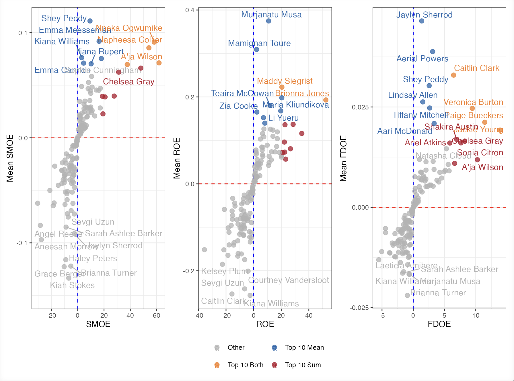

**Shots, Boards & Whistles: A Decomposed Expected Points Framework for  WNBA Offense**

## Project Overview
Traditional basketball statistics often evaluate what happened without measuring the quality of the opportunity that produced it. This project develops an Expected Points framework for evaluating offensive performance in the WNBA by modeling the different ways a shot attempt can generate value.

Using 2024 WNBA play-by-play data, I trained separate logistic regression models to estimate:
- The probability that a shot is made
- The probability that the offense secures an offensive rebound
- The probability that the shooter draws a foul

These predictions were combined into a unified expected-value metric, allowing offensive opportunities to be evaluated beyond their immediate box-score outcome. The model was then tested on out-of-sample 2025 data to assess its stability and predictive performance.

## Key Findings
- Shot conversion and foul-drawing models demonstrated stronger predictive discrimination than the offensive-rebound model.
- The framework revealed meaningful differences in expected value across shot types, players, and teams.
- Residual-based measures identified players and teams that performed above or below model expectations.
- The metric separates opportunity generation from execution, offering a more detailed view of offensive performance than traditional statistics alone.

*Project complete but paper currently under review; a sample of analysis in paper can seen below.*

